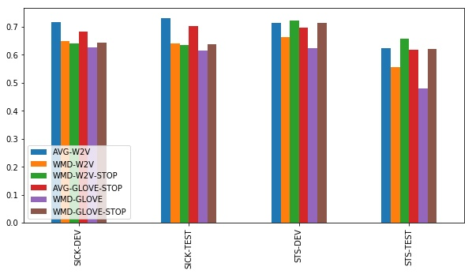

# text2vec
text2vec, chinese text to vetor.(文本向量化表示工具，包括词向量化、句子向量化)


## Feature
#### 文本向量表示
- 字词粒度，通过腾讯AI Lab开源的大规模高质量中文[词向量数据（800万中文词）](https://ai.tencent.com/ailab/nlp/embedding.html)，获取字词的word2vec向量表示。
- 句子粒度，通过求句子中所有单词词嵌入的平均值计算得到。
- 篇章粒度，可以通过gensim库的doc2vec得到，应用较少，本项目不实现。

#### 文本相似度计算

- 基准方法，估计两句子间语义相似度最简单的方法就是求句子中所有单词词嵌入的平均值，然后计算两句子词嵌入之间的余弦相似性。
- 词移距离（Word Mover’s Distance），词移距离使用两文本间的词嵌入，测量其中一文本中的单词在语义空间中移动到另一文本单词所需要的最短距离。

#### query和docs的相似度比较
- rank_bm25方法，使用bm25的变种算法，对query和文档之间的相似度打分，得到docs的rank排序。

## Result

#### 文本相似度计算
- 基准方法

尽管文本相似度计算的基准方法很简洁，但用平均词嵌入之间求余弦相似度的表现非常好。实验有以下结论：

    1. 简单word2vec嵌入比GloVe嵌入表现的好
    2. 在用word2vec时，尚不清楚使用停用词表或TF-IDF加权是否更有帮助。在STS数据集上，有一点儿帮助；在SICK上没有帮助。
    仅计算未加权的所有word2vec嵌入平均值表现得很好。
    3. 在使用GloVe时，停用词列表对于达到好的效果非常重要。利用TF-IDF加权没有帮助。


- 词移距离

基于我们的结果，好像没有什么使用词移距离的必要了，因为上述方法表现得已经很好了。只有在STS-TEST数据集上，而且只有在有停止词列表的情况下，词移距离才能和简单基准方法一较高下。




## Install
```
pip3 install text2vec
```

or

```
git clone https://github.com/shibing624/text2vec.git
cd text2vec
python3 setup.py install
```

## Usage:
- get text vector
```

import text2vec

char = '我'
result = text2vec.encode(char)
print(type(result))
print(char, result)

word = '如何'
print(word, text2vec.encode(word))

a = '如何更换花呗绑定银行卡'
emb = text2vec.encode(a)
print(a, emb)

```

output:
```
<class 'numpy.ndarray'>

我 [ 0.09639428 -0.14142498  0.02505628  0.0041334   0.0891804  -0.06853037
  0.02480385 -0.00202681  0.04466304  0.05935134  0.06626346  0.02792982
 -0.00122364 -0.03564163  0.07814336 -0.01186718 -0.11831381 -0.11164719
 -0.02129865 -0.07289924  0.04736083  0.03148666  0.0069021   0.06107369
  0.05683238  0.03053819 -0.08670152  0.05620533  0.07051748 -0.05775733
 -0.06013909  0.01728704 -0.09136213  0.06711558 -0.04173594 -0.02561434
  0.05425368  0.03572141 -0.04812391 -0.01005812  0.06470105 -0.0451101
  0.15059438 -0.01418728 -0.01992586 -0.06219057 -0.13712125 -0.12005735
 -0.03480378  0.03263514 -0.07109519  0.0348165  -0.03788928  0.09889127
  0.11274981  0.10584888  0.01515579  0.05810804  0.09212908 -0.00454269
 -0.00543566  0.05205266  0.0584021  -0.0804438  -0.06611045  0.03084343
 -0.04473973  0.06157432 -0.02384768 -0.05748833 -0.02527673  0.01138004
 -0.00781241  0.03804575 -0.02640479  0.09191326  0.06730249 -0.00140863
  0.0620499  -0.00100859  0.07805665  0.10646782  0.01515771  0.00322501
  0.09958808 -0.09815517 -0.01788325  0.16031606 -0.14252146 -0.02714591
  0.06375182  0.06440738  0.0184521   0.04068496 -0.04900571  0.07306651
 -0.00885414 -0.08097681 -0.11459395  0.02762651 -0.04301392  0.10227238
 -0.04200803  0.09554062 -0.16738118  0.08341715  0.01308196 -0.21252482
 -0.0279776   0.00378847 -0.01116383 -0.07013363 -0.01257285 -0.0692449
  0.04969056 -0.03360519  0.04637883 -0.08535262 -0.07740378 -0.08435328
  0.10678192 -0.14141536  0.00149496 -0.01076225  0.02682565 -0.02223825
 -0.00421857 -0.01385815  0.01504094  0.1415518   0.01730477  0.04969364
 -0.01507254 -0.03407345 -0.08115987 -0.07544018 -0.10216408  0.0452157
  0.02203438 -0.05174242 -0.08257467 -0.0952562  -0.10572978  0.02118689
 -0.04278769 -0.21874475  0.08206749 -0.08594112 -0.01051675  0.0765378
 -0.02013667  0.0574494  -0.09336312 -0.07500815 -0.01579092 -0.00288663
  0.06478816 -0.03055091  0.10146458 -0.14296041  0.07345422  0.00590546
  0.04438054  0.02884167  0.11858089  0.07869641 -0.04057319  0.11500401
  0.05857592  0.01748282 -0.04934178 -0.02514994 -0.05786794  0.0535087
 -0.02894727  0.00732565 -0.06997523 -0.01715678  0.08051819  0.02614966
  0.02278166 -0.01140278 -0.05325858 -0.00350828 -0.03232952 -0.09715197
 -0.08663831  0.17373216  0.03861999 -0.01943024  0.01957477  0.03680631
 -0.06960409  0.00120206  0.06818929  0.14162116 -0.01620831 -0.1274574
 -0.06394182  0.07477807]

如何 [ 0.06810352 -0.08764309 -0.17884995  0.04245819  0.02336426 -0.02783544
  0.06590004  0.12069131 -0.02275313  0.08401067 -0.03448813 -0.06049466
  0.12863354 -0.03209582 -0.03612204  0.00362007  0.00314833  0.00619469
 -0.01213532 -0.09656382 -0.04146219  0.00231953  0.00174171  0.0271117
  0.00818223 -0.00104956 -0.09993841 -0.02183198  0.07726219  0.00041921
  0.01363636 -0.01703223 -0.06390563  0.07788395 -0.01639742 -0.14369163
  0.02305046  0.0683569  -0.08594155 -0.0213084  -0.00761265 -0.07338737
  0.13582699  0.01095255 -0.07006943  0.08011182 -0.10606958 -0.16954331
 -0.03405314 -0.03307533 -0.07097033  0.00720958 -0.13473761  0.0367754
  0.00470293  0.02153603  0.07739814  0.10769045  0.06356196 -0.00139975
  0.01541481  0.01098036  0.08189129 -0.04122426 -0.02263022 -0.04607138
 -0.00799958  0.04095509 -0.07214727  0.01755615 -0.11867802  0.1082226
  0.06589935  0.02035189  0.02284274  0.04474579 -0.02315277  0.01303897
  0.13132113 -0.01138618  0.11616931  0.00221345  0.01073317  0.11483684
  0.17069861  0.00324721  0.00323863 -0.00397782 -0.08618944 -0.15210217
  0.0195969  -0.03466495 -0.03609114  0.02363171  0.02051325 -0.07529319
  0.06390701 -0.0271014  -0.02912533 -0.01742466  0.01823835  0.04229751
 -0.02156246  0.01846254 -0.17319703  0.13903712 -0.02853858 -0.11243801
 -0.05781119  0.03835334 -0.03296547 -0.09496803 -0.05368094 -0.03711357
  0.02450755 -0.08000436 -0.04013968  0.03684784 -0.03671325 -0.07045121
  0.09821077 -0.1460613  -0.01098998  0.08690219  0.05496465  0.07503603
 -0.02715427 -0.08370098 -0.04442512  0.0314016  -0.0600085   0.07480428
  0.05781635 -0.03007086 -0.1828779  -0.01764439 -0.06853852 -0.09553899
 -0.11341341 -0.02138084 -0.13171732 -0.09366097 -0.05124879 -0.02400766
  0.01209962 -0.07369807  0.07936954  0.07424844  0.06005416  0.06026772
  0.00390057 -0.01239145 -0.02252447 -0.01972531 -0.03385297 -0.01676581
  0.12987983  0.08010083 -0.05111421  0.07096861  0.08854055 -0.047535
  0.0758638   0.12433025  0.0837003  -0.04745981 -0.03734464  0.06471486
  0.06312044 -0.02487079  0.01503028 -0.00422398  0.05623531  0.0443513
 -0.00504454 -0.02940514  0.05094254  0.06081155 -0.02248568  0.09960916
  0.13226974 -0.02347515  0.02261408  0.06550967 -0.07489939  0.0041742
 -0.16706997  0.00364204  0.06112364  0.07898124  0.15337628  0.0064879
 -0.05187571  0.01824728 -0.02559968  0.05454201  0.01981526 -0.16468726
 -0.03895245  0.11330663]
如何更换花呗绑定银行卡 [ 4.71473671e-02 -1.22305982e-01 -2.12236792e-02  3.39640938e-02
  3.26218940e-02  2.51194951e-03 -9.80294216e-03  3.33396234e-02
 -2.46070307e-02  6.95534423e-02 -5.89465210e-03  3.96882631e-02
  3.10125891e-02 -1.78968478e-02  1.63691677e-03 -1.47556812e-02
  8.12981743e-03 -1.04401030e-01  2.93718055e-02 -2.31537987e-02
 -1.55210902e-03  3.67316641e-02  2.80683432e-02  5.63009493e-02
  3.66984606e-02  2.67446339e-02 -6.09265119e-02  2.06250418e-02
  1.01904936e-01 -1.33597264e-02  5.54306842e-02  2.54548024e-02
  1.59489959e-02  5.97294681e-02 -2.86895093e-02 -3.61352153e-02
  3.82692069e-02  8.32856726e-03 -5.34493625e-02 -2.39155143e-02
  2.78946590e-02  5.29401610e-03  1.31121367e-01  3.13527733e-02
 -3.64133976e-02 -3.31716277e-02 -1.18844829e-01 -9.76441875e-02
  2.62140227e-03 -4.36915457e-02 -7.55050480e-02  6.90378295e-03
 -6.51865676e-02  1.12797217e-02  6.03484623e-05  3.94979827e-02
  3.37654091e-02  8.28023180e-02  6.92032054e-02 -2.42828075e-02
  4.40855920e-02  1.05403922e-01 -1.30977882e-02  1.89940203e-02
 -9.76285562e-02 -2.71702912e-02 -2.91591231e-02  1.52317865e-03
  1.83054358e-02 -5.53635769e-02 -4.44861688e-02  1.34623377e-02
  7.85428137e-02  8.14519003e-02  3.96539085e-02 -7.57815549e-03
  7.51054520e-03  2.13148277e-02  5.27925789e-02 -3.34585570e-02
  1.64962485e-02  5.18316925e-02  7.03734532e-03  8.45126137e-02
  2.79792771e-02 -6.21730201e-02 -5.25910147e-02  3.04365810e-02
 -4.75352593e-02 -8.10647234e-02  4.32261266e-02 -2.53967941e-04
 -8.23310483e-03 -3.05013675e-02 -3.32328342e-02  1.85522605e-02
  6.47867247e-02 -2.05814615e-02  2.69556548e-02 -2.60420982e-02
 -4.44194302e-05 -1.83110554e-02 -1.98158417e-02  6.47451915e-03
 -9.93665680e-02  5.52967936e-02 -1.16585968e-02 -1.05088204e-01
 -9.22452286e-03 -1.68982649e-03  3.77633274e-02 -1.93512943e-02
 -4.66921590e-02 -3.39296572e-02  2.09407452e-02  7.37647898e-03
 -3.51853371e-02 -4.51993048e-02  8.61309178e-04 -8.89335647e-02
  8.17673653e-02 -1.06067717e-01 -1.33159235e-02 -1.67979542e-02
  2.47655530e-02  3.21167223e-02 -6.62103817e-02 -1.76203419e-02
 -4.52234261e-02  6.64740195e-03  5.83182275e-03  7.48575956e-04
 -3.63951921e-03 -4.48432863e-02 -3.88430431e-02  2.32965145e-02
 -6.07735366e-02 -6.85143098e-02 -4.12832163e-02  2.55517811e-02
 -3.85841839e-02 -7.80499727e-02 -1.05228074e-01 -5.12892157e-02
  1.32089825e-02 -5.07609658e-02  2.06051320e-02  2.54724231e-02
  3.19314934e-02  2.25739554e-02 -3.10087036e-02  1.89237464e-02
  3.40532511e-02  1.36880958e-02 -4.27350141e-02  3.03224493e-02
  8.84194449e-02  2.34019365e-02  3.85737233e-02 -1.94936115e-02
  1.03267193e-01 -3.22679318e-02 -1.88098047e-02  6.23626895e-02
  3.53455469e-02  1.62524953e-02 -7.97030628e-02  8.44071135e-02
  8.44921395e-02 -4.12725806e-02  1.53134828e-02 -3.21318582e-02
  6.93896180e-03  5.43021224e-02  2.06528846e-02 -3.25725973e-03
 -3.17559801e-02  1.36494962e-02 -2.63690371e-02  4.86064889e-02
  4.24649119e-02  3.99889657e-03 -4.23174240e-02  3.28378715e-02
  5.26446430e-03  1.66716408e-02 -9.32565331e-02  2.26303097e-02
 -5.16547728e-03 -7.30370581e-02  7.16320351e-02 -2.17113476e-02
 -4.19992171e-02 -1.58459302e-02  1.98304523e-02  1.01010799e-01
  5.10275662e-02 -4.41706069e-02 -7.12427571e-02  4.57431376e-02]

```

- get similarity score between text1 and text2

```
from text2vec import Similarity

a = '如何更换花呗绑定银行卡'
b = '花呗更改绑定银行卡'

sim = Similarity()
s = sim.get_score(a, b)
print(s)

```

output:
```
0.9519710685638405
```


- get text similarity score between query and docs

```

from text2vec import SearchSimilarity

a = '如何更换花呗绑定银行卡'
b = '花呗更改绑定银行卡'
c = '我什么时候开通了花呗'

corpus = [a, b, c]
print(corpus)
search_sim = SearchSimilarity(corpus=corpus)

print(a, 'scores:', search_sim.get_scores(query=a))
print(a, 'rank similarities:', search_sim.get_similarities(query=a))
```

output:
```
['如何更换花呗绑定银行卡', '花呗更改绑定银行卡', '我什么时候开通了花呗']
如何更换花呗绑定银行卡 scores: [ 0.9527457  -0.07449248 -0.03204909]
如何更换花呗绑定银行卡 rank similarities: ['如何更换花呗绑定银行卡', '我什么时候开通了花呗', '花呗更改绑定银行卡']
```


## Reference

1. [将句子表示为向量（上）：无监督句子表示学习（sentence embedding）](https://www.cnblogs.com/llhthinker/p/10335164.html)
2. [将句子表示为向量（下）：无监督句子表示学习（sentence embedding）](https://www.cnblogs.com/llhthinker/p/10341841.html)
3. [A Simple but Tough-to-Beat Baseline for Sentence Embeddings[Sanjeev Arora and Yingyu Liang and Tengyu Ma, 2017]](https://openreview.net/forum?id=SyK00v5xx)
4. [四种计算文本相似度的方法对比[Yves Peirsman]](https://zhuanlan.zhihu.com/p/37104535)
5. [Improvements to BM25 and Language Models Examined](http://www.cs.otago.ac.nz/homepages/andrew/papers/2014-2.pdf)