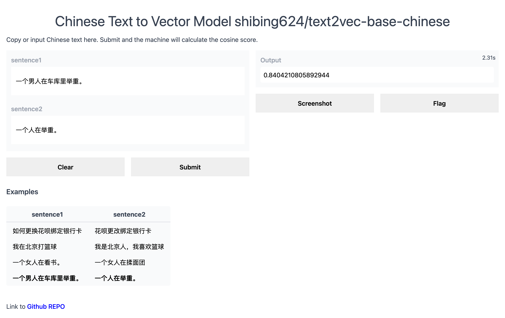
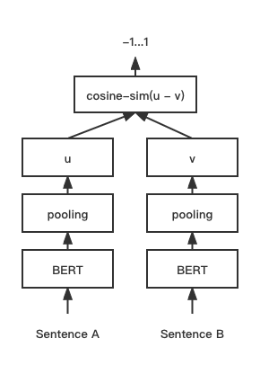
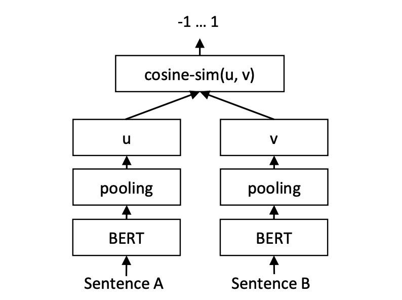
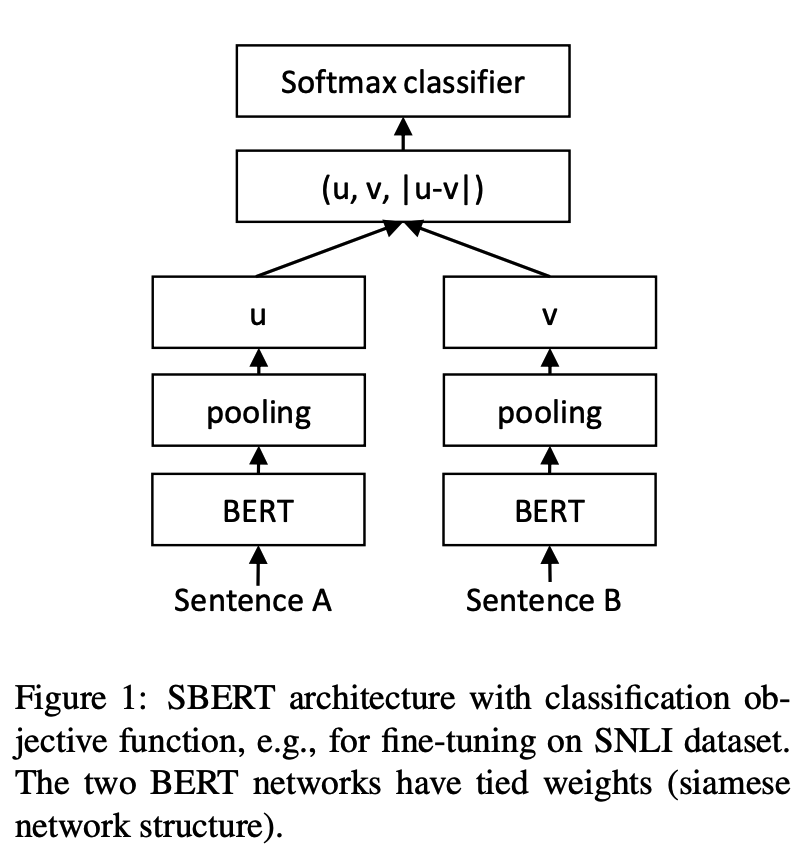
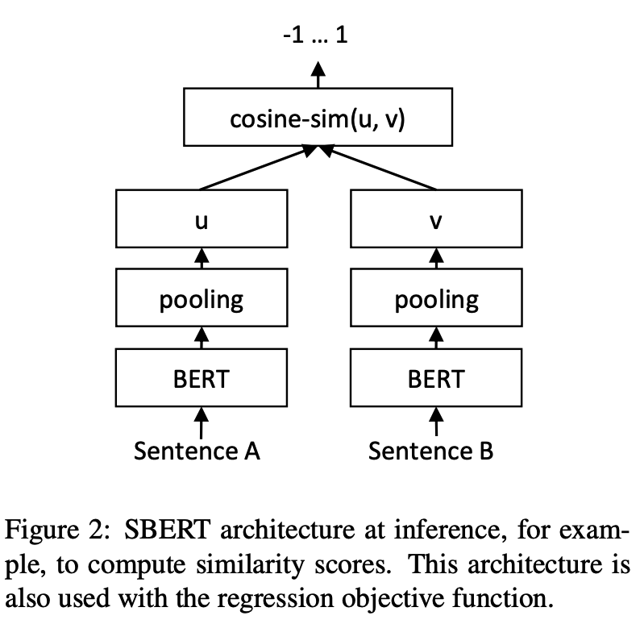
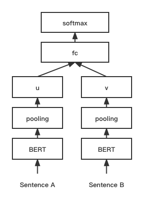

[](https://badge.fury.io/py/text2vec)
[](https://pepy.tech/project/text2vec)
[](CONTRIBUTING.md)
[](https://github.com/shibing624/text2vec/graphs/contributors)
[](LICENSE)
[](requirements.txt)
[](https://github.com/shibing624/text2vec/issues)
[](#Contact)

# Text2vec
text2vec, Text to Vector.

文本向量表征工具，把文本转化为向量矩阵，是文本进行计算机处理的第一步。

**text2vec**实现了Word2Vec、RankBM25、BERT、Sentence-BERT、CoSENT等多种文本表征、文本相似度计算模型，并在文本语义匹配（相似度计算）任务上比较了各模型的效果。


**Guide**
- [Question](#Question)
- [Solution](#Solution)
- [Feature](#Feature)
- [Evaluate](#Evaluate)
- [Install](#install)
- [Usage](#usage)
- [Contact](#Contact)
- [Citation](#Citation)
- [Reference](#reference)

# Question
文本向量表示咋做？文本匹配任务用哪个模型效果好？

许多NLP任务的成功离不开训练优质有效的文本表示向量。特别是文本语义匹配（Semantic Textual Similarity，如paraphrase检测、QA的问题对匹配）、文本向量检索（Dense Text Retrieval）等任务。
# Solution
### 传统方法：基于特征的匹配

- 基于TF-IDF、BM25、Jaccord、SimHash、LDA等算法抽取两个文本的词汇、主题等层面的特征，然后使用机器学习模型（LR, xgboost）训练分类模型
- 优点：可解释性较好
- 缺点：依赖人工寻找特征，泛化能力一般，而且由于特征数量的限制，模型的效果比较一般

代表模型：
- BM25

BM25算法，通过候选句子的字段对qurey字段的覆盖程度来计算两者间的匹配得分，得分越高的候选项与query的匹配度更好，主要解决词汇层面的相似度问题。

### 深度方法：基于表征的匹配
- 基于表征的匹配方式，初始阶段对两个文本各自单独处理，通过深层的神经网络进行编码（encode），得到文本的表征（embedding），再对两个表征进行相似度计算的函数得到两个文本的相似度
- 优点：基于BERT的模型通过有监督的Fine-tune在文本表征和文本匹配任务取得了不错的性能
- 缺点：BERT自身导出的句向量（不经过Fine-tune，对所有词向量求平均）质量较低，甚至比不上Glove的结果，因而难以反映出两个句子的语义相似度

> 主要原因是：
> 
> 1.BERT对所有的句子都倾向于编码到一个较小的空间区域内，这使得大多数的句子对都具有较高的相似度分数，即使是那些语义上完全无关的句子对。
> 
> 2.BERT句向量表示的聚集现象和句子中的高频词有关。具体来说，当通过平均词向量的方式计算句向量时，那些高频词的词向量将会主导句向量，使之难以体现其原本的语义。当计算句向量时去除若干高频词时，聚集现象可以在一定程度上得到缓解，但表征能力会下降。


代表模型：

- [DSSM(2013)](https://posenhuang.github.io/papers/cikm2013_DSSM_fullversion.pdf)
- [CDSSM(2014)](https://www.microsoft.com/en-us/research/wp-content/uploads/2016/02/www2014_cdssm_p07.pdf)
- [ARC I(2014)](https://arxiv.org/pdf/1503.03244.pdf)
- [Siamese Network(2016)](https://www.aclweb.org/anthology/W16-1617.pdf)
- [InferSent(2017)](https://arxiv.org/pdf/1705.02364.pdf)
- [BERT(2018)](https://arxiv.org/pdf/1810.04805.pdf)
- [Sentence-BERT(2019)](https://arxiv.org/abs/1908.10084)
- [BERT-flow(2020)](https://arxiv.org/abs/2011.05864)
- [SimCSE(2021)](https://arxiv.org/abs/2104.08821)
- [ConSERT(2021)](https://aclanthology.org/2021.acl-long.393/)
- [CoSENT(2022)](https://kexue.fm/archives/8847)

由于2018年BERT模型在NLP界带来了翻天覆地的变化，此处不讨论和比较2018年之前的模型（如果有兴趣了解的同学，可以参考中科院开源的[MatchZoo](https://github.com/NTMC-Community/MatchZoo) 和[MatchZoo-py](https://github.com/NTMC-Community/MatchZoo-py)）。

所以，本项目主要调研以下比原生BERT更优、适合文本匹配的向量表示模型：Sentence-BERT(2019)、BERT-flow(2020)、SimCSE(2021)、CoSENT(2022)。

### 深度方法：基于交互的匹配

- 基于交互的匹配方式，则认为在最后阶段才计算文本的相似度会过于依赖文本表征的质量，同时也会丢失基础的文本特征（比如词法、句法等），所以提出尽可能早的对文本特征进行交互，捕获更基础的特征，最后在高层基于这些基础匹配特征计算匹配分数
- 优点：基于交互的匹配模型端到端处理，效果好
- 缺点：这类模型（Cross-Encoder）的输入要求是两个句子，输出的是句子对的相似度值，模型不会产生句子向量表示（sentence embedding），我们也无法把单个句子输入给模型。因此，对于需要文本向量表示的任务来说，这类模型并不实用


代表模型：

- [ARC II(2014)](https://arxiv.org/pdf/1503.03244.pdf)
- [MV-LSTM(2015)](https://arxiv.org/pdf/1511.08277.pdf)
- [MatchPyramid(2016)](https://arxiv.org/pdf/1602.06359.pdf)
- [DRMM(2016)](https://www.bigdatalab.ac.cn/~gjf/papers/2016/CIKM2016a_guo.pdf)
- [Conv-KNRM(2018)](https://www.cs.cmu.edu/~zhuyund/papers/WSDM_2018_Dai.pdf)
- [RE2(2019)](https://www.aclweb.org/anthology/P19-1465.pdf)
- [Keyword-BERT(2020)](https://arxiv.org/ftp/arxiv/papers/2003/2003.11516.pdf)

Cross-Encoder适用于向量检索精排。

# Feature
### 文本向量表示模型
- [Word2Vec](text2vec/word2vec.py)：通过腾讯AI Lab开源的大规模高质量中文[词向量数据（800万中文词轻量版）](https://pan.baidu.com/s/1La4U4XNFe8s5BJqxPQpeiQ) (文件名：light_Tencent_AILab_ChineseEmbedding.bin 密码: tawe）实现词向量检索，本项目实现了句子（词向量求平均）的word2vec向量表示
- [SBERT(Sentence-BERT)](text2vec/sentence_bert)：权衡性能和效率的句向量表示模型，训练时通过有监督训练上层分类函数，文本匹配预测时直接句子向量做余弦，本项目基于PyTorch复现了Sentence-BERT模型的训练和预测
- [CoSENT(Cosine Sentence)](text2vec/cosent)：CoSENT模型提出了一种排序的损失函数，使训练过程更贴近预测，模型收敛速度和效果比Sentence-BERT更好，本项目基于PyTorch实现了CoSENT模型的训练和预测

### 文本相似度比较方法

- 余弦相似（Cosine Similarity）：两向量求余弦
- 点积（Dot Product）：两向量归一化后求内积
- 词移距离（Word Mover’s Distance）：词移距离使用两文本间的词向量，测量其中一文本中的单词在语义空间中移动到另一文本单词所需要的最短距离
- [RankBM25](text2vec/bm25.py)：BM25的变种算法，对query和文档之间的相似度打分，得到docs的rank排序
- [SemanticSearch](https://github.com/shibing624/text2vec/blob/master/text2vec/similarity.py#L144)：向量相似检索，使用Cosine Similarty + topk高效计算，比一对一暴力计算快一个数量级

# Evaluate

### 文本匹配

- 英文匹配数据集的评测结果：

| Arch | Backbone | Model Name | English-STS-B | 
| :-- | :--- | :--- | :-: |
| GloVe | glove | Avg_word_embeddings_glove_6B_300d | 61.77 |
| BERT | bert-base-uncased | BERT-base-cls | 20.29 |
| BERT | bert-base-uncased | BERT-base-first_last_avg | 59.04 |
| BERT | bert-base-uncased | BERT-base-first_last_avg-whiten(NLI) | 63.65 |
| SBERT | sentence-transformers/bert-base-nli-mean-tokens | SBERT-base-nli-cls | 73.65 |
| SBERT | sentence-transformers/bert-base-nli-mean-tokens | SBERT-base-nli-first_last_avg | 77.96 |
| SBERT | xlm-roberta-base | paraphrase-multilingual-MiniLM-L12-v2 | 84.42 |
| CoSENT | bert-base-uncased | CoSENT-base-first_last_avg | 69.93 |
| CoSENT | sentence-transformers/bert-base-nli-mean-tokens | CoSENT-base-nli-first_last_avg | 79.68 |

- 中文匹配数据集的评测结果：

| Arch | Backbone | Model Name | ATEC | BQ | LCQMC | PAWSX | STS-B | Avg | QPS |
| :-- | :--- | :--- | :-: | :-: | :-: | :-: | :-: | :-: | :-: |
| CoSENT | hfl/chinese-macbert-base | CoSENT-macbert-base | 50.39 | **72.93** | **79.17** | **60.86** | **80.51** | **68.77**  | 2572 |
| CoSENT | Langboat/mengzi-bert-base | CoSENT-mengzi-base | **50.52** | 72.27 | 78.69 | 12.89 | 80.15 | 58.90 | 2502 |
| CoSENT | bert-base-chinese | CoSENT-bert-base | 49.74 | 72.38 | 78.69 | 60.00 | 80.14 | 68.19 | 2653 |
| SBERT | bert-base-chinese | SBERT-bert-base | 46.36 | 70.36 | 78.72 | 46.86 | 66.41 | 61.74 | 1365 |
| SBERT | hfl/chinese-macbert-base | SBERT-macbert-base | 47.28 | 68.63 | **79.42** | 55.59 | 64.82 | 63.15 | 1948 |
| CoSENT | hfl/chinese-roberta-wwm-ext | CoSENT-roberta-ext | **50.81** | **71.45** | **79.31** | **61.56** | **81.13** | **68.85** | - |
| SBERT | hfl/chinese-roberta-wwm-ext | SBERT-roberta-ext | 48.29 | 69.99 | 79.22 | 44.10 | 72.42 | 62.80 | - |

- 本项目release模型的中文匹配评测结果：

| Arch | Backbone | Model Name | ATEC | BQ | LCQMC | PAWSX | STS-B | Avg | QPS |
| :-- | :--- | :---- | :-: | :-: | :-: | :-: | :-: | :-: | :-: |
| Word2Vec | word2vec | w2v-light-tencent-chinese | 20.00 | 31.49 | 59.46 | 2.57 | 55.78 | 33.86 | 10283 |
| SBERT | xlm-roberta-base | paraphrase-multilingual-MiniLM-L12-v2 | 18.42 | 38.52 | 63.96 | 10.14 | 78.90 | 41.99 | 2371 |
| CoSENT | hfl/chinese-macbert-base | text2vec-base-chinese | 31.93 | 42.67 | 70.16 | 17.21 | 79.30 | **48.25** | 2572 |

说明：
- 结果值均使用spearman系数
- 结果均只用该数据集的train训练，在test上评估得到的表现，没用外部数据
- `paraphrase-multilingual-MiniLM-L12-v2`模型名称是`sentence-transformers/paraphrase-multilingual-MiniLM-L12-v2`，是`paraphrase-MiniLM-L12-v2`模型的多语言版本，速度快，效果好，支持中文
- `CoSENT-macbert-base`模型达到同级别参数量SOTA效果，是用CoSENT方法训练，运行[examples/training_sup_cosent.py](examples/training_sup_cosent.py)代码复现结果
- `SBERT-macbert-base`模型，是用SBERT方法训练，运行[examples/training_sup_sentencebert.py](examples/training_sup_sentencebert.py)代码复现结果
- `text2vec-base-chinese`模型，是用CoSENT方法训练，基于MacBERT在中文STS-B数据训练得到，模型文件已经上传到huggingface的模型库[shibing624/text2vec-base-chinese](https://huggingface.co/shibing624/text2vec-base-chinese)，中文语义匹配任务推荐使用
- `w2v-light-tencent-chinese`是腾讯词向量的Word2Vec模型，CPU加载使用，适用于中文字面匹配任务和缺少数据的冷启动情况
- 各预训练模型均可以通过transformers调用，如MacBERT模型：`--model_name hfl/chinese-macbert-base`
- 中文匹配数据集下载[链接见下方](#数据集)
- 中文匹配任务实验表明，pooling最优是`first_last_avg`，即 SentenceModel 的`EncoderType.FIRST_LAST_AVG`
- QPS的GPU测试环境是Tesla V100，显存32GB

# Demo

Official Demo: http://42.193.145.218/product/short_text_sim/

HuggingFace Demo: https://huggingface.co/spaces/shibing624/text2vec



# Install
```
pip3 install torch # conda install pytorch
pip3 install -U text2vec
```

or

```
git clone https://github.com/shibing624/text2vec.git
cd text2vec
python3 setup.py install
```

### 数据集
中文语义匹配数据集已经上传到huggingface datasets [https://huggingface.co/datasets/shibing624/nli_zh](https://huggingface.co/datasets/shibing624/nli_zh)

数据集使用示例：
```shell
pip3 install datasets
```

```python
from datasets import load_dataset

dataset = load_dataset("shibing624/nli_zh", "STS-B") # ATEC or BQ or LCQMC or PAWSX or STS-B
print(dataset)
print(dataset['test'][0])
```

output:
```shell
DatasetDict({
    train: Dataset({
        features: ['sentence1', 'sentence2', 'label'],
        num_rows: 5231
    })
    validation: Dataset({
        features: ['sentence1', 'sentence2', 'label'],
        num_rows: 1458
    })
    test: Dataset({
        features: ['sentence1', 'sentence2', 'label'],
        num_rows: 1361
    })
})
{'sentence1': '一个女孩在给她的头发做发型。', 'sentence2': '一个女孩在梳头。', 'label': 2}
```

常见中文语义匹配数据集，包含[ATEC](https://github.com/IceFlameWorm/NLP_Datasets/tree/master/ATEC)、[BQ](http://icrc.hitsz.edu.cn/info/1037/1162.htm)、
[LCQMC](http://icrc.hitsz.edu.cn/Article/show/171.html)、[PAWSX](https://arxiv.org/abs/1908.11828)、[STS-B](https://github.com/pluto-junzeng/CNSD)共5个任务。
可以从数据集对应的链接自行下载，也可以从[百度网盘(提取码:qkt6)](https://pan.baidu.com/s/1d6jSiU1wHQAEMWJi7JJWCQ)下载。
其中senteval_cn目录是评测数据集汇总，senteval_cn.zip是senteval目录的打包，两者下其一就好。

# Usage

## 文本向量表征

基于`pretrained model`计算文本向量：

```shell
>>> from text2vec import SentenceModel
>>> m = SentenceModel()
>>> m.encode("如何更换花呗绑定银行卡")
Embedding shape: (384,)
```

example: [examples/computing_embeddings_demo.py](examples/computing_embeddings_demo.py)

```python
import sys

sys.path.append('..')
from text2vec import SentenceModel, EncoderType
from text2vec import Word2Vec


def compute_emb(model):
    # Embed a list of sentences
    sentences = [
        '卡',
        '银行卡',
        '如何更换花呗绑定银行卡',
        '花呗更改绑定银行卡',
        'This framework generates embeddings for each input sentence',
        'Sentences are passed as a list of string.',
        'The quick brown fox jumps over the lazy dog.'
    ]
    sentence_embeddings = model.encode(sentences)
    print(type(sentence_embeddings), sentence_embeddings.shape)

    # The result is a list of sentence embeddings as numpy arrays
    for sentence, embedding in zip(sentences, sentence_embeddings):
        print("Sentence:", sentence)
        print("Embedding shape:", embedding.shape)
        print("Embedding head:", embedding[:10])
        print()


if __name__ == "__main__":
    # 中文句向量模型(CoSENT)，中文语义匹配任务推荐，支持fine-tune继续训练
    t2v_model = SentenceModel("shibing624/text2vec-base-chinese",
                              encoder_type=EncoderType.FIRST_LAST_AVG)
    compute_emb(t2v_model)

    # 支持多语言的句向量模型（Sentence-BERT），英文语义匹配任务推荐，支持fine-tune继续训练
    sbert_model = SentenceModel("sentence-transformers/paraphrase-multilingual-MiniLM-L12-v2",
                                encoder_type=EncoderType.MEAN)
    compute_emb(sbert_model)

    # 中文词向量模型(word2vec)，中文字面匹配任务和冷启动适用
    w2v_model = Word2Vec("w2v-light-tencent-chinese")
    compute_emb(w2v_model)

```

output:
```
<class 'numpy.ndarray'> (7, 768)
Sentence: 卡
Embedding shape: (768,)

Sentence: 银行卡
Embedding shape: (768,)
 ... 
```

- 返回值`embeddings`是`numpy.ndarray`类型，shape为`(sentences_size, model_embedding_size)`
- `shibing624/text2vec-base-chinese`模型是CoSENT方法在中文STS-B数据集训练得到的，模型已经上传到huggingface的
模型库[shibing624/text2vec-base-chinese](https://huggingface.co/shibing624/text2vec-base-chinese)，
是`text2vec.SentenceModel`指定的默认模型，可以通过上面示例调用，或者如下所示用[transformers库](https://github.com/huggingface/transformers)调用，
模型自动下载到本机路径：`~/.cache/huggingface/transformers`
- `sentence-transformers/paraphrase-multilingual-MiniLM-L12-v2`模型是Sentence-BERT的多语言句向量模型，
适用于释义（paraphrase）识别，文本匹配，通过`text2vec.SentenceModel`和[sentence-transformers库]((https://github.com/UKPLab/sentence-transformers))都可以调用该模型
- `w2v-light-tencent-chinese`是通过gensim加载的Word2Vec模型，使用腾讯词向量`Tencent_AILab_ChineseEmbedding.tar.gz`计算各字词的词向量，句子向量通过单词词
向量取平均值得到，模型自动下载到本机路径：`~/.text2vec/datasets/light_Tencent_AILab_ChineseEmbedding.bin`

#### Usage (HuggingFace Transformers)
Without [text2vec](https://github.com/shibing624/text2vec), you can use the model like this: 

First, you pass your input through the transformer model, then you have to apply the right pooling-operation on-top of the contextualized word embeddings.

example: [examples/use_origin_transformers_demo.py](examples/use_origin_transformers_demo.py)

```python
import os
import torch
from transformers import AutoTokenizer, AutoModel

os.environ["KMP_DUPLICATE_LIB_OK"] = "TRUE"


# Mean Pooling - Take attention mask into account for correct averaging
def mean_pooling(model_output, attention_mask):
    token_embeddings = model_output[0]  # First element of model_output contains all token embeddings
    input_mask_expanded = attention_mask.unsqueeze(-1).expand(token_embeddings.size()).float()
    return torch.sum(token_embeddings * input_mask_expanded, 1) / torch.clamp(input_mask_expanded.sum(1), min=1e-9)


# Load model from HuggingFace Hub
tokenizer = AutoTokenizer.from_pretrained('shibing624/text2vec-base-chinese')
model = AutoModel.from_pretrained('shibing624/text2vec-base-chinese')
sentences = ['如何更换花呗绑定银行卡', '花呗更改绑定银行卡']
# Tokenize sentences
encoded_input = tokenizer(sentences, padding=True, truncation=True, return_tensors='pt')

# Compute token embeddings
with torch.no_grad():
    model_output = model(**encoded_input)
# Perform pooling. In this case, max pooling.
sentence_embeddings = mean_pooling(model_output, encoded_input['attention_mask'])
print("Sentence embeddings:")
print(sentence_embeddings)
```

#### 提供两种`Word2Vec`词向量，任选一个：

  - 轻量版腾讯词向量 [百度云盘-密码:tawe](https://pan.baidu.com/s/1La4U4XNFe8s5BJqxPQpeiQ) 或 [谷歌云盘](https://drive.google.com/u/0/uc?id=1iQo9tBb2NgFOBxx0fA16AZpSgc-bG_Rp&export=download)，二进制，运行程序，自动下载到 `~/.text2vec/datasets/light_Tencent_AILab_ChineseEmbedding.bin`
  - [腾讯词向量-官方全量](https://ai.tencent.com/ailab/nlp/zh/download.html), 6.78G放到： `~/.text2vec/datasets/Tencent_AILab_ChineseEmbedding.txt`，腾讯词向量主页：https://ai.tencent.com/ailab/nlp/zh/embedding.html 词向量下载地址：https://ai.tencent.com/ailab/nlp/zh/data/Tencent_AILab_ChineseEmbedding.tar.gz  更多查看[腾讯词向量介绍-wiki](https://github.com/shibing624/text2vec/wiki/%E8%85%BE%E8%AE%AF%E8%AF%8D%E5%90%91%E9%87%8F%E4%BB%8B%E7%BB%8D)


## 下游任务
### 1. 句子相似度计算

example: [examples/semantic_text_similarity_demo.py](examples/semantic_text_similarity_demo.py)

```python
import sys

sys.path.append('..')
from text2vec import Similarity

# Two lists of sentences
sentences1 = ['如何更换花呗绑定银行卡',
              'The cat sits outside',
              'A man is playing guitar',
              'The new movie is awesome']

sentences2 = ['花呗更改绑定银行卡',
              'The dog plays in the garden',
              'A woman watches TV',
              'The new movie is so great']

sim_model = Similarity()
for i in range(len(sentences1)):
    for j in range(len(sentences2)):
        score = sim_model.get_score(sentences1[i], sentences2[j])
        print("{} \t\t {} \t\t Score: {:.4f}".format(sentences1[i], sentences2[j], score))
```

output:
```shell
如何更换花呗绑定银行卡 		 花呗更改绑定银行卡 		 Score: 0.9477
如何更换花呗绑定银行卡 		 The dog plays in the garden 		 Score: -0.1748
如何更换花呗绑定银行卡 		 A woman watches TV 		 Score: -0.0839
如何更换花呗绑定银行卡 		 The new movie is so great 		 Score: -0.0044
The cat sits outside 		 花呗更改绑定银行卡 		 Score: -0.0097
The cat sits outside 		 The dog plays in the garden 		 Score: 0.1908
The cat sits outside 		 A woman watches TV 		 Score: -0.0203
The cat sits outside 		 The new movie is so great 		 Score: 0.0302
A man is playing guitar 		 花呗更改绑定银行卡 		 Score: -0.0010
A man is playing guitar 		 The dog plays in the garden 		 Score: 0.1062
A man is playing guitar 		 A woman watches TV 		 Score: 0.0055
A man is playing guitar 		 The new movie is so great 		 Score: 0.0097
The new movie is awesome 		 花呗更改绑定银行卡 		 Score: 0.0302
The new movie is awesome 		 The dog plays in the garden 		 Score: -0.0160
The new movie is awesome 		 A woman watches TV 		 Score: 0.1321
The new movie is awesome 		 The new movie is so great 		 Score: 0.9591
```

> 句子余弦相似度值`score`范围是[-1, 1]，值越大越相似。

### 2. 文本匹配搜索

一般在文档候选集中找与query最相似的文本，常用于QA场景的问句相似匹配、文本相似检索等任务。


example: [examples/semantic_search_demo.py](examples/semantic_search_demo.py)

```python
import sys

sys.path.append('..')
from text2vec import SentenceModel, cos_sim, semantic_search

embedder = SentenceModel()

# Corpus with example sentences
corpus = [
    '花呗更改绑定银行卡',
    '我什么时候开通了花呗',
    'A man is eating food.',
    'A man is eating a piece of bread.',
    'The girl is carrying a baby.',
    'A man is riding a horse.',
    'A woman is playing violin.',
    'Two men pushed carts through the woods.',
    'A man is riding a white horse on an enclosed ground.',
    'A monkey is playing drums.',
    'A cheetah is running behind its prey.'
]
corpus_embeddings = embedder.encode(corpus)

# Query sentences:
queries = [
    '如何更换花呗绑定银行卡',
    'A man is eating pasta.',
    'Someone in a gorilla costume is playing a set of drums.',
    'A cheetah chases prey on across a field.']

for query in queries:
    query_embedding = embedder.encode(query)
    hits = semantic_search(query_embedding, corpus_embeddings, top_k=5)
    print("\n\n======================\n\n")
    print("Query:", query)
    print("\nTop 5 most similar sentences in corpus:")
    hits = hits[0]  # Get the hits for the first query
    for hit in hits:
        print(corpus[hit['corpus_id']], "(Score: {:.4f})".format(hit['score']))
```
output:
```shell
Query: 如何更换花呗绑定银行卡
Top 5 most similar sentences in corpus:
花呗更改绑定银行卡 (Score: 0.9477)
我什么时候开通了花呗 (Score: 0.3635)
A man is eating food. (Score: 0.0321)
A man is riding a horse. (Score: 0.0228)
Two men pushed carts through the woods. (Score: 0.0090)

======================
Query: A man is eating pasta.
Top 5 most similar sentences in corpus:
A man is eating food. (Score: 0.6734)
A man is eating a piece of bread. (Score: 0.4269)
A man is riding a horse. (Score: 0.2086)
A man is riding a white horse on an enclosed ground. (Score: 0.1020)
A cheetah is running behind its prey. (Score: 0.0566)

======================
Query: Someone in a gorilla costume is playing a set of drums.
Top 5 most similar sentences in corpus:
A monkey is playing drums. (Score: 0.8167)
A cheetah is running behind its prey. (Score: 0.2720)
A woman is playing violin. (Score: 0.1721)
A man is riding a horse. (Score: 0.1291)
A man is riding a white horse on an enclosed ground. (Score: 0.1213)

======================
Query: A cheetah chases prey on across a field.
Top 5 most similar sentences in corpus:
A cheetah is running behind its prey. (Score: 0.9147)
A monkey is playing drums. (Score: 0.2655)
A man is riding a horse. (Score: 0.1933)
A man is riding a white horse on an enclosed ground. (Score: 0.1733)
A man is eating food. (Score: 0.0329)
```


#### similarities

[推荐]文本相似度计算和文本匹配搜索任务，推荐使用 [similarities库](https://github.com/shibing624/similarities) ，兼容本项目release的
Word2vec、SBERT、Cosent类语义匹配模型，还支持字面维度相似度计算、匹配搜索算法，支持文本、图像。

安装：
```pip install -U similarities```

句子相似度计算：
```python
from similarities import Similarity

m = Similarity()
r = m.similarity('如何更换花呗绑定银行卡', '花呗更改绑定银行卡')
print(f"similarity score: {float(r)}")  # similarity score: 0.855146050453186
```

# Models

## CoSENT model

CoSENT（Cosine Sentence）文本匹配模型，在Sentence-BERT上改进了CosineRankLoss的句向量方案


Network structure:

Training:




Inference:



#### CoSENT 监督模型
训练和预测，最简示例:

```python
from text2vec import CosentModel
m = CosentModel("bert-base-chinese")
print(m)
m.train_model(use_hf_dataset=True, num_epochs=1, output_dir="./temp")
r = m.encode(["我爱北京天安门"])
print(r)
```

- 在中文STS-B数据集训练和评估`MacBERT+CoSENT`模型

example: [examples/training_sup_text_matching_model.py](examples/training_sup_text_matching_model.py)

```shell
cd examples
python3 training_sup_text_matching_model.py --model_arch cosent --do_train --do_predict --num_epochs 10 --model_name hfl/chinese-macbert-base --output_dir ./outputs/STS-B-cosent
```

- 在蚂蚁金融匹配数据集ATEC上训练和评估`MacBERT+CoSENT`模型

支持这些中文匹配数据集的使用：'ATEC', 'STS-B', 'BQ', 'LCQMC', 'PAWSX'，具体参考HuggingFace datasets [https://huggingface.co/datasets/shibing624/nli_zh](https://huggingface.co/datasets/shibing624/nli_zh)
```shell
python3 training_sup_text_matching_model.py --task_name ATEC --model_arch cosent --do_train --do_predict --num_epochs 10 --model_name hfl/chinese-macbert-base --output_dir ./outputs/ATEC-cosent
```

- 在自有中文数据集上训练模型

example: [examples/training_sup_text_matching_model_selfdata.py](examples/training_sup_text_matching_model_selfdata.py)

```shell
python3 training_sup_text_matching_model_selfdata.py --do_train --do_predict
```

- 在英文STS-B数据集训练和评估`BERT+CoSENT`模型

example: [examples/training_sup_text_matching_model_en.py](examples/training_sup_text_matching_model_en.py)

```shell
cd examples
python3 training_sup_text_matching_model_en.py --model_arch cosent --do_train --do_predict --num_epochs 10 --model_name bert-base-uncased  --output_dir ./outputs/STS-B-en-cosent
```

#### CoSENT 无监督模型
- 在英文NLI数据集训练`BERT+CoSENT`模型，在STS-B测试集评估效果

example: [examples/training_unsup_text_matching_model_en.py](examples/training_unsup_text_matching_model_en.py)

```shell
cd examples
python3 training_unsup_text_matching_model_en.py --model_arch cosent --do_train --do_predict --num_epochs 10 --model_name bert-base-uncased --output_dir ./outputs/STS-B-en-unsup-cosent
```


## Sentence-BERT model

Sentence-BERT文本匹配模型，表征式句向量表示方案

Network structure:

Training:




Inference:



#### SentenceBERT 监督模型
- 在中文STS-B数据集训练和评估`MacBERT+SBERT`模型

example: [examples/training_sup_text_matching_model.py](examples/training_sup_text_matching_model.py)

```shell
cd examples
python3 training_sup_text_matching_model.py --model_arch sentencebert --do_train --do_predict --num_epochs 10 --model_name hfl/chinese-macbert-base --output_dir ./outputs/STS-B-sbert
```
- 在英文STS-B数据集训练和评估`BERT+SBERT`模型

example: [examples/training_sup_text_matching_model_en.py](examples/training_sup_text_matching_model_en.py)

```shell
cd examples
python3 training_sup_text_matching_model_en.py --model_arch sentencebert --do_train --do_predict --num_epochs 10 --model_name bert-base-uncased --output_dir ./outputs/STS-B-en-sbert
```

#### SentenceBERT 无监督模型
- 在英文NLI数据集训练`BERT+SBERT`模型，在STS-B测试集评估效果

example: [examples/training_unsup_text_matching_model_en.py](examples/training_unsup_text_matching_model_en.py)

```shell
cd examples
python3 training_unsup_text_matching_model_en.py --model_arch sentencebert --do_train --do_predict --num_epochs 10 --model_name bert-base-uncased --output_dir ./outputs/STS-B-en-unsup-sbert
```

## BERT-Match model
BERT文本匹配模型，孪生网络结构，表征式句向量表示

Network structure:

Training:




Inference:


训练脚本同上。


# Contact

- Issue(建议)：[](https://github.com/shibing624/text2vec/issues)
- 邮件我：xuming: xuming624@qq.com
- 微信我：
加我*微信号：xuming624, 备注：姓名-公司-NLP* 进NLP交流群。


# Citation

如果你在研究中使用了text2vec，请按如下格式引用：

APA:
```latex
Xu, M. Text2vec: Text to vector toolkit (Version 1.1.2) [Computer software]. https://github.com/shibing624/text2vec
```

BibTeX:
```latex
@software{Xu_Text2vec_Text_to,
author = {Xu, Ming},
title = {{Text2vec: Text to vector toolkit}},
url = {https://github.com/shibing624/text2vec},
version = {1.1.2}
}
```

# License


授权协议为 [The Apache License 2.0](LICENSE)，可免费用做商业用途。请在产品说明中附加text2vec的链接和授权协议。


# Contribute
项目代码还很粗糙，如果大家对代码有所改进，欢迎提交回本项目，在提交之前，注意以下两点：

 - 在`tests`添加相应的单元测试
 - 使用`python setup.py test`来运行所有单元测试，确保所有单测都是通过的

之后即可提交PR。

# Reference
- [将句子表示为向量（上）：无监督句子表示学习（sentence embedding）](https://www.cnblogs.com/llhthinker/p/10335164.html)
- [将句子表示为向量（下）：无监督句子表示学习（sentence embedding）](https://www.cnblogs.com/llhthinker/p/10341841.html)
- [A Simple but Tough-to-Beat Baseline for Sentence Embeddings[Sanjeev Arora and Yingyu Liang and Tengyu Ma, 2017]](https://openreview.net/forum?id=SyK00v5xx)
- [四种计算文本相似度的方法对比[Yves Peirsman]](https://zhuanlan.zhihu.com/p/37104535)
- [Improvements to BM25 and Language Models Examined](http://www.cs.otago.ac.nz/homepages/andrew/papers/2014-2.pdf)
- [CoSENT：比Sentence-BERT更有效的句向量方案](https://kexue.fm/archives/8847)
- [谈谈文本匹配和多轮检索](https://zhuanlan.zhihu.com/p/111769969)
- [Sentence-transformers](https://www.sbert.net/examples/applications/computing-embeddings/README.html)
