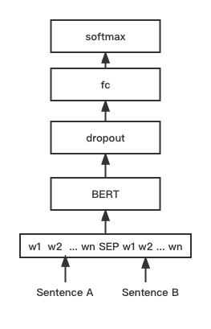

[**🇨🇳中文**](https://github.com/shibing624/text2vec/blob/master/README.md) | [**🌐English**](https://github.com/shibing624/text2vec/blob/master/README_EN.md) | [**📖文档/Docs**](https://github.com/shibing624/text2vec/wiki) | [**🤖模型/Models**](https://huggingface.co/shibing624) 

<div align="center">
  <a href="https://github.com/shibing624/text2vec">
    
  </a>
</div>

-----------------

# Text2vec: Text to Vector
[](https://badge.fury.io/py/text2vec)
[](https://pepy.tech/project/text2vec)
[](CONTRIBUTING.md)
[](LICENSE)
[](requirements.txt)
[](https://github.com/shibing624/text2vec/issues)
[](#Contact)

**Text2vec**: Text to Vector, Get Sentence Embeddings. Text vectorization, representing text (including words, sentences, paragraphs) as a vector matrix.

**text2vec** implements Word2Vec, RankBM25, BERT, Sentence-BERT, CoSENT and other text representation and text similarity calculation models, and compares the effects of each model on the text semantic matching (similarity calculation) task.

**Guide**
- [Feature](#Feature)
- [Evaluation](#Evaluation)
- [Install](#install)
- [Usage](#usage)
- [Contact](#Contact)
- [Reference](#reference)


# Feature
### 文本向量表示模型
- [Word2Vec](https://github.com/shibing624/text2vec/blob/master/text2vec/word2vec.py): large-scale high-quality Chinese [word vector data (8 million Chinese words light weight) through Tencent AI Lab open source version)](https://pan.baidu.com/s/1La4U4XNFe8s5BJqxPQpeiQ) (file name: light_Tencent_AILab_ChineseEmbedding.bin password: tawe) to achieve word vector retrieval, this project realizes word2vec vector representation of sentences (word vector average)
- [SBERT(Sentence-BERT)](https://github.com/shibing624/text2vec/blob/master/text2vec/sentencebert_model.py): A sentence vector representation model that balances performance and efficiency, and supervises the upper layer during training Classification function, direct sentence vector as cosine when text matching prediction, this project reproduces the training and prediction of Sentence-BERT model based on PyTorch
- [CoSENT(Cosine Sentence)](https://github.com/shibing624/text2vec/blob/master/text2vec/cosent_model.py): The CoSENT model proposes a sorted loss function to make the training process closer to the prediction, The model convergence speed and effect are better than Sentence-BERT. This project implements the training and prediction of the CoSENT model based on PyTorch
# Evaluation

### 文本匹配

- 英文匹配数据集的评测结果：

| Arch | Backbone | Model Name | English-STS-B | 
| :-- | :--- | :--- | :-: |
| GloVe | glove | Avg_word_embeddings_glove_6B_300d | 61.77 |
| BERT | bert-base-uncased | BERT-base-cls | 20.29 |
| BERT | bert-base-uncased | BERT-base-first_last_avg | 59.04 |
| BERT | bert-base-uncased | BERT-base-first_last_avg-whiten(NLI) | 63.65 |
| SBERT | sentence-transformers/bert-base-nli-mean-tokens | SBERT-base-nli-cls | 73.65 |
| SBERT | sentence-transformers/bert-base-nli-mean-tokens | SBERT-base-nli-first_last_avg | 77.96 |
| SBERT | xlm-roberta-base | paraphrase-multilingual-MiniLM-L12-v2 | 84.42 |
| CoSENT | bert-base-uncased | CoSENT-base-first_last_avg | 69.93 |
| CoSENT | sentence-transformers/bert-base-nli-mean-tokens | CoSENT-base-nli-first_last_avg | 79.68 |

- Evaluation results of Chinese matching dataset:

| Arch | Backbone | Model Name | ATEC | BQ | LCQMC | PAWSX | STS-B | Avg | QPS |
| :-- | :--- | :--- | :-: | :-: | :-: | :-: | :-: | :-: | :-: |
| CoSENT | hfl/chinese-macbert-base | CoSENT-macbert-base | 50.39 | **72.93** | **79.17** | **60.86** | **80.51** | **68.77**  | 3008 |
| CoSENT | Langboat/mengzi-bert-base | CoSENT-mengzi-base | **50.52** | 72.27 | 78.69 | 12.89 | 80.15 | 58.90 | 2502 |
| CoSENT | bert-base-chinese | CoSENT-bert-base | 49.74 | 72.38 | 78.69 | 60.00 | 80.14 | 68.19 | 2653 |
| SBERT | bert-base-chinese | SBERT-bert-base | 46.36 | 70.36 | 78.72 | 46.86 | 66.41 | 61.74 | 3365 |
| SBERT | hfl/chinese-macbert-base | SBERT-macbert-base | 47.28 | 68.63 | **79.42** | 55.59 | 64.82 | 63.15 | 2948 |
| CoSENT | hfl/chinese-roberta-wwm-ext | CoSENT-roberta-ext | **50.81** | **71.45** | **79.31** | **61.56** | **81.13** | **68.85** | - |
| SBERT | hfl/chinese-roberta-wwm-ext | SBERT-roberta-ext | 48.29 | 69.99 | 79.22 | 44.10 | 72.42 | 62.80 | - |

- Chinese matching evaluation results of the release model of this project:

| Arch | Backbone | Model Name | ATEC  |  BQ   | LCQMC | PAWSX | STS-B |    Avg    | QPS |
| :-- | :--- | :---- |:-----:|:-----:|:-----:|:-----:|:-----:|:---------:| :-: |
| Word2Vec | word2vec | w2v-light-tencent-chinese | 20.00 | 31.49 | 59.46 | 2.57  | 55.78 |   33.86   | 23769 |
| SBERT | xlm-roberta-base | paraphrase-multilingual-MiniLM-L12-v2 | 18.42 | 38.52 | 63.96 | 10.14 | 78.90 |   41.99   | 3138 |
| CoSENT | hfl/chinese-macbert-base | [shibing624/text2vec-base-chinese](https://huggingface.co/shibing624/text2vec-base-chinese) | 31.93 | 42.67 | 70.16 | 17.21 | 79.30 | **48.25** | 3008 |
| CoSENT | hfl/chinese-lert-large | [GanymedeNil/text2vec-large-chinese](https://huggingface.co/GanymedeNil/text2vec-large-chinese) | 32.61 | 44.59 | 69.30 | 14.51 | 79.44 |   48.08   | 1046 |


Evaluation conclusion:
- The result values are all using the spearman coefficient
- The results only use the train training of the data set, and evaluate the performance obtained on the test, without using external data
- [shibing624/text2vec-base-chinese](https://huggingface.co/shibing624/text2vec-base-chinese) model is trained with CoSENT method, based on MacBERT in Chinese STS-B data training, and in Chinese STS -B test set evaluation reaches SOTA, run [examples/training_sup_text_matching_model.py](https://github.com/shibing624/text2vec/blob/master/examples/training_sup_text_matching_model.py) code to train the model, the model file has been uploaded to huggingface The model library [shibing624/text2vec-base-chinese](https://huggingface.co/shibing624/text2vec-base-chinese), recommended for Chinese semantic matching tasks
- The `SBERT-macbert-base` model is trained with the SBERT method, and the code can be trained by running [examples/training_sup_text_matching_model.py](https://github.com/shibing624/text2vec/blob/master/examples/training_sup_text_matching_model.py) Model
- `paraphrase-multilingual-MiniLM-L12-v2` model name is [sentence-transformers/paraphrase-multilingual-MiniLM-L12-v2](https://huggingface.co/sentence-transformers/paraphrase-multilingual-MiniLM-L12 -v2), trained with SBERT, is a multilingual version of the `paraphrase-MiniLM-L12-v2` model, supports Chinese, English, etc.
- `w2v-light-tencent-chinese` is the Word2Vec model of Tencent word vectors, which is loaded and used by CPU, and is suitable for Chinese literal matching tasks and cold start situations with lack of data
- Each pre-trained model can be called through transformers, such as MacBERT model: `--model_name hfl/chinese-macbert-base` or roberta model: `--model_name uer/roberta-medium-wwm-chinese-cluecorpussmall`
- Chinese matching data set download [link below] (#data set)
- The Chinese matching task experiment shows that the optimal pooling is `first_last_avg`, that is, `EncoderType.FIRST_LAST_AVG` of SentenceModel, which has little difference in prediction effect from the method of `EncoderType.MEAN`
- Chinese matching evaluation results are reappearing, you can download the Chinese matching dataset to `examples/data`, run [tests/test_model_spearman.py](https://github.com/shibing624/text2vec/blob/master/tests/test_model_spearman. py) code to reproduce the evaluation results
- The GPU test environment of QPS is Tesla V100 with 32GB of video memory
# Demo

Official Demo: https://www.mulanai.com/product/short_text_sim/

HuggingFace Demo: https://huggingface.co/spaces/shibing624/text2vec


run example: [examples/gradio_demo.py](https://github.com/shibing624/text2vec/blob/master/examples/gradio_demo.py) to see the demo:
```shell
python examples/gradio_demo.py
```

# Install
```shell
pip install torch # conda install pytorch
pip install -U text2vec
```

or

```shell
pip install torch # conda install pytorch
pip install -r requirements.txt

git clone https://github.com/shibing624/text2vec.git
cd text2vec
pip install --no-deps .
```

# Usage

## 文本向量表征

Compute text vectors based on `pretrained model`:

```zsh
>>> from text2vec import SentenceModel
>>> m = SentenceModel()
>>> m.encode("如何更换花呗绑定银行卡")
Embedding shape: (768,)
```

example: [examples/computing_embeddings_demo.py](https://github.com/shibing624/text2vec/blob/master/examples/computing_embeddings_demo.py)

```python
import sys

sys.path.append('..')
from text2vec import SentenceModel
from text2vec import Word2Vec


def compute_emb(model):
    # Embed a list of sentences
    sentences = [
        '卡',
        '银行卡',
        '如何更换花呗绑定银行卡',
        '花呗更改绑定银行卡',
        'This framework generates embeddings for each input sentence',
        'Sentences are passed as a list of string.',
        'The quick brown fox jumps over the lazy dog.'
    ]
    sentence_embeddings = model.encode(sentences)
    print(type(sentence_embeddings), sentence_embeddings.shape)

    # The result is a list of sentence embeddings as numpy arrays
    for sentence, embedding in zip(sentences, sentence_embeddings):
        print("Sentence:", sentence)
        print("Embedding shape:", embedding.shape)
        print("Embedding head:", embedding[:10])
        print()


if __name__ == "__main__":
    # 中文句向量模型(CoSENT)，中文语义匹配任务推荐，支持fine-tune继续训练
    t2v_model = SentenceModel("shibing624/text2vec-base-chinese")
    compute_emb(t2v_model)

    # 支持多语言的句向量模型（Sentence-BERT），英文语义匹配任务推荐，支持fine-tune继续训练
    sbert_model = SentenceModel("sentence-transformers/paraphrase-multilingual-MiniLM-L12-v2")
    compute_emb(sbert_model)

    # 中文词向量模型(word2vec)，中文字面匹配任务和冷启动适用
    w2v_model = Word2Vec("w2v-light-tencent-chinese")
    compute_emb(w2v_model)

```

output:
```
<class 'numpy.ndarray'> (7, 768)
Sentence: 卡
Embedding shape: (768,)

Sentence: 银行卡
Embedding shape: (768,)
 ... 
```

- The return value `embeddings` is of `numpy.ndarray` type, and the shape is `(sentences_size, model_embedding_size)`. You can choose one of the three models, and the first one is recommended.
- The `shibing624/text2vec-base-chinese` model is trained by the CoSENT method on the Chinese STS-B dataset, and the model has been uploaded to huggingface
Model library [shibing624/text2vec-base-chinese](https://huggingface.co/shibing624/text2vec-base-chinese),
It is the default model specified by `text2vec.SentenceModel`, which can be called by the above example, or by [transformers library](https://github.com/huggingface/transformers) as shown below,
The model is automatically downloaded to the local path: `~/.cache/huggingface/transformers`
- The `sentence-transformers/paraphrase-multilingual-MiniLM-L12-v2` model is a multilingual sentence vector model of Sentence-BERT,
Suitable for paraphrase recognition and text matching, the model can be called through `text2vec.SentenceModel` and [sentence-transformers library]((https://github.com/UKPLab/sentence-transformers))
- `w2v-light-tencent-chinese` is a Word2Vec model loaded by gensim, using the Tencent word vector `Tencent_AILab_ChineseEmbedding.tar.gz` to calculate the word vector of each word, and the sentence vector through the word word
The average value of the vector is obtained, and the model is automatically downloaded to the local path: `~/.text2vec/datasets/light_Tencent_AILab_ChineseEmbedding.bin`
#### Usage (HuggingFace Transformers)
Without [text2vec](https://github.com/shibing624/text2vec), you can use the model like this: 

First, you pass your input through the transformer model, then you have to apply the right pooling-operation on-top of the contextualized word embeddings.

example: [examples/use_origin_transformers_demo.py](https://github.com/shibing624/text2vec/blob/master/examples/use_origin_transformers_demo.py)

```python
import os
import torch
from transformers import AutoTokenizer, AutoModel

os.environ["KMP_DUPLICATE_LIB_OK"] = "TRUE"


# Mean Pooling - Take attention mask into account for correct averaging
def mean_pooling(model_output, attention_mask):
    token_embeddings = model_output[0]  # First element of model_output contains all token embeddings
    input_mask_expanded = attention_mask.unsqueeze(-1).expand(token_embeddings.size()).float()
    return torch.sum(token_embeddings * input_mask_expanded, 1) / torch.clamp(input_mask_expanded.sum(1), min=1e-9)


# Load model from HuggingFace Hub
tokenizer = AutoTokenizer.from_pretrained('shibing624/text2vec-base-chinese')
model = AutoModel.from_pretrained('shibing624/text2vec-base-chinese')
sentences = ['如何更换花呗绑定银行卡', '花呗更改绑定银行卡']
# Tokenize sentences
encoded_input = tokenizer(sentences, padding=True, truncation=True, return_tensors='pt')

# Compute token embeddings
with torch.no_grad():
    model_output = model(**encoded_input)
# Perform pooling. In this case, max pooling.
sentence_embeddings = mean_pooling(model_output, encoded_input['attention_mask'])
print("Sentence embeddings:")
print(sentence_embeddings)
```

#### Usage (sentence-transformers)
[sentence-transformers](https://github.com/UKPLab/sentence-transformers) is a popular library to compute dense vector representations for sentences.

Install sentence-transformers:
```shell
pip install -U sentence-transformers
```
Then load model and predict:
```python
from sentence_transformers import SentenceTransformer

m = SentenceTransformer("shibing624/text2vec-base-chinese")
sentences = ['如何更换花呗绑定银行卡', '花呗更改绑定银行卡']

sentence_embeddings = m.encode(sentences)
print("Sentence embeddings:")
print(sentence_embeddings)
```

#### `Word2Vec` word vector model
Two `Word2Vec` word vectors are provided, choose one:

   - Lightweight version of Tencent Word Vector [Baidu Cloud Disk-Password: tawe](https://pan.baidu.com/s/1La4U4XNFe8s5BJqxPQpeiQ) or [Google Cloud Disk](https://drive.google.com/u/ 0/uc?id=1iQo9tBb2NgFOBxx0fA16AZpSgc-bG_Rp&export=download), binary file, 111M, is a simplified high-frequency 143613 words, each word vector is still 200 dimensions (same as the original version), run the program, and automatically download to `~/ .text2vec/datasets/light_Tencent_AILab_ChineseEmbedding.bin`
   - Tencent word vector - official full volume, 6.78G put: `~/.text2vec/datasets/Tencent_AILab_ChineseEmbedding.txt`, Tencent word vector homepage: https://ai.tencent.com/ailab/nlp/zh/index.html Word vector download address: https://ai.tencent.com/ailab/nlp/en/download.html For more information, see [Tencent Word Vector Introduction-wiki](https://github.com/shibing624/text2vec/wiki/ %E8%85%BE%E8%AE%AF%E8%AF%8D%E5%90%91%E9%87%8F%E4%BB%8B%E7%BB%8D)

## Downstream tasks
### 1. Sentence similarity calculation

example: [examples/semantic_text_similarity_demo.py](https://github.com/shibing624/text2vec/blob/master/examples/semantic_text_similarity_demo.py)

```python
import sys

sys.path.append('..')
from text2vec import Similarity

# Two lists of sentences
sentences1 = ['如何更换花呗绑定银行卡',
              'The cat sits outside',
              'A man is playing guitar',
              'The new movie is awesome']

sentences2 = ['花呗更改绑定银行卡',
              'The dog plays in the garden',
              'A woman watches TV',
              'The new movie is so great']

sim_model = Similarity()
for i in range(len(sentences1)):
    for j in range(len(sentences2)):
        score = sim_model.get_score(sentences1[i], sentences2[j])
        print("{} \t\t {} \t\t Score: {:.4f}".format(sentences1[i], sentences2[j], score))
```

output:
```shell
如何更换花呗绑定银行卡 		 花呗更改绑定银行卡 		 Score: 0.9477
如何更换花呗绑定银行卡 		 The dog plays in the garden 		 Score: -0.1748
如何更换花呗绑定银行卡 		 A woman watches TV 		 Score: -0.0839
如何更换花呗绑定银行卡 		 The new movie is so great 		 Score: -0.0044
The cat sits outside 		 花呗更改绑定银行卡 		 Score: -0.0097
The cat sits outside 		 The dog plays in the garden 		 Score: 0.1908
The cat sits outside 		 A woman watches TV 		 Score: -0.0203
The cat sits outside 		 The new movie is so great 		 Score: 0.0302
A man is playing guitar 		 花呗更改绑定银行卡 		 Score: -0.0010
A man is playing guitar 		 The dog plays in the garden 		 Score: 0.1062
A man is playing guitar 		 A woman watches TV 		 Score: 0.0055
A man is playing guitar 		 The new movie is so great 		 Score: 0.0097
The new movie is awesome 		 花呗更改绑定银行卡 		 Score: 0.0302
The new movie is awesome 		 The dog plays in the garden 		 Score: -0.0160
The new movie is awesome 		 A woman watches TV 		 Score: 0.1321
The new movie is awesome 		 The new movie is so great 		 Score: 0.9591
```

> Sentence cosine similarity value `score` ranges from [-1, 1], the larger the value, the more similar it is.

### 2. Text matching search

Generally, the text that is most similar to the query is found in the document candidate set, which is often used in tasks such as question similarity matching and text similarity retrieval in QA scenarios.


example: [examples/semantic_search_demo.py](https://github.com/shibing624/text2vec/blob/master/examples/semantic_search_demo.py)

```python
import sys

sys.path.append('..')
from text2vec import SentenceModel, cos_sim, semantic_search

embedder = SentenceModel()

# Corpus with example sentences
corpus = [
    '花呗更改绑定银行卡',
    '我什么时候开通了花呗',
    'A man is eating food.',
    'A man is eating a piece of bread.',
    'The girl is carrying a baby.',
    'A man is riding a horse.',
    'A woman is playing violin.',
    'Two men pushed carts through the woods.',
    'A man is riding a white horse on an enclosed ground.',
    'A monkey is playing drums.',
    'A cheetah is running behind its prey.'
]
corpus_embeddings = embedder.encode(corpus)

# Query sentences:
queries = [
    '如何更换花呗绑定银行卡',
    'A man is eating pasta.',
    'Someone in a gorilla costume is playing a set of drums.',
    'A cheetah chases prey on across a field.']

for query in queries:
    query_embedding = embedder.encode(query)
    hits = semantic_search(query_embedding, corpus_embeddings, top_k=5)
    print("\n\n======================\n\n")
    print("Query:", query)
    print("\nTop 5 most similar sentences in corpus:")
    hits = hits[0]  # Get the hits for the first query
    for hit in hits:
        print(corpus[hit['corpus_id']], "(Score: {:.4f})".format(hit['score']))
```
output:
```shell
Query: 如何更换花呗绑定银行卡
Top 5 most similar sentences in corpus:
花呗更改绑定银行卡 (Score: 0.9477)
我什么时候开通了花呗 (Score: 0.3635)
A man is eating food. (Score: 0.0321)
A man is riding a horse. (Score: 0.0228)
Two men pushed carts through the woods. (Score: 0.0090)

======================
Query: A man is eating pasta.
Top 5 most similar sentences in corpus:
A man is eating food. (Score: 0.6734)
A man is eating a piece of bread. (Score: 0.4269)
A man is riding a horse. (Score: 0.2086)
A man is riding a white horse on an enclosed ground. (Score: 0.1020)
A cheetah is running behind its prey. (Score: 0.0566)

======================
Query: Someone in a gorilla costume is playing a set of drums.
Top 5 most similar sentences in corpus:
A monkey is playing drums. (Score: 0.8167)
A cheetah is running behind its prey. (Score: 0.2720)
A woman is playing violin. (Score: 0.1721)
A man is riding a horse. (Score: 0.1291)
A man is riding a white horse on an enclosed ground. (Score: 0.1213)

======================
Query: A cheetah chases prey on across a field.
Top 5 most similar sentences in corpus:
A cheetah is running behind its prey. (Score: 0.9147)
A monkey is playing drums. (Score: 0.2655)
A man is riding a horse. (Score: 0.1933)
A man is riding a white horse on an enclosed ground. (Score: 0.1733)
A man is eating food. (Score: 0.0329)
```


## Downstream task support library
**similarities library [recommended]**

For text similarity calculation and text matching search tasks, it is recommended to use [similarities library](https://github.com/shibing624/similarities), which is compatible with the release of this project
Word2vec, SBERT, and Cosent semantic matching models also support literal dimension similarity calculations, matching search algorithms, and text and images.

Install:
```pip install -U similarities```

Sentence similarity calculation:
```python
from similarities import Similarity

m = Similarity()
r = m.similarity('如何更换花呗绑定银行卡', '花呗更改绑定银行卡')
print(f"similarity score: {float(r)}")  # similarity score: 0.855146050453186
```

# Models

## CoSENT model

CoSENT (Cosine Sentence) text matching model, improved the sentence vector scheme of CosineRankLoss on Sentence-BERT


Network structure:

Training:


Inference:


#### CoSENT Supervised Model
Train and predict CoSENT model:

- Train and evaluate the `CoSENT` model on the Chinese STS-B dataset

example: [examples/training_sup_text_matching_model.py](https://github.com/shibing624/text2vec/blob/master/examples/training_sup_text_matching_model.py)

```shell
cd examples
python training_sup_text_matching_model.py --model_arch cosent --do_train --do_predict --num_epochs 10 --model_name hfl/chinese-macbert-base --output_dir ./outputs/STS-B-cosent
```

- Train and evaluate the `CoSENT` model on the Ant Financial matching dataset ATEC

Support the use of these Chinese matching datasets: 'ATEC', 'STS-B', 'BQ', 'LCQMC', 'PAWSX', for details refer to HuggingFace datasets [https://huggingface.co/datasets/shibing624/nli_zh] (https://huggingface.co/datasets/shibing624/nli_zh)
```shell
python training_sup_text_matching_model.py --task_name ATEC --model_arch cosent --do_train --do_predict --num_epochs 10 --model_name hfl/chinese-macbert-base --output_dir ./outputs/ATEC-cosent
```

- Train the model on our own Chinese dataset

example: [examples/training_sup_text_matching_model_selfdata.py](https://github.com/shibing624/text2vec/blob/master/examples/training_sup_text_matching_model_selfdata.py)

```shell
python training_sup_text_matching_model_selfdata.py --do_train --do_predict
```

- Train and evaluate the `CoSENT` model on the English STS-B dataset

example: [examples/training_sup_text_matching_model_en.py](https://github.com/shibing624/text2vec/blob/master/examples/training_sup_text_matching_model_en.py)

```shell
cd examples
python training_sup_text_matching_model_en.py --model_arch cosent --do_train --do_predict --num_epochs 10 --model_name bert-base-uncased  --output_dir ./outputs/STS-B-en-cosent
```

#### CoSENT Unsupervised Model
- Train the `CoSENT` model on the English NLI dataset and evaluate the effect on the STS-B test set

example: [examples/training_unsup_text_matching_model_en.py](https://github.com/shibing624/text2vec/blob/master/examples/training_unsup_text_matching_model_en.py)

```shell
cd examples
python training_unsup_text_matching_model_en.py --model_arch cosent --do_train --do_predict --num_epochs 10 --model_name bert-base-uncased --output_dir ./outputs/STS-B-en-unsup-cosent
```


## Sentence-BERT model

Sentence-BERT text matching model, representational sentence vector representation scheme

Network structure:

Training:


Inference:


#### SentenceBERT Supervised Model
- Train and evaluate the `SBERT` model on the Chinese STS-B dataset

example: [examples/training_sup_text_matching_model.py](https://github.com/shibing624/text2vec/blob/master/examples/training_sup_text_matching_model.py)

```shell
cd examples
python training_sup_text_matching_model.py --model_arch sentencebert --do_train --do_predict --num_epochs 10 --model_name hfl/chinese-macbert-base --output_dir ./outputs/STS-B-sbert
```
- Train and evaluate the `SBERT` model on the English STS-B dataset

example: [examples/training_sup_text_matching_model_en.py](https://github.com/shibing624/text2vec/blob/master/examples/training_sup_text_matching_model_en.py)

```shell
cd examples
python training_sup_text_matching_model_en.py --model_arch sentencebert --do_train --do_predict --num_epochs 10 --model_name bert-base-uncased --output_dir ./outputs/STS-B-en-sbert
```

#### SentenceBERT Unsupervised Model
- Train the `SBERT` model on the English NLI dataset and evaluate the effect on the STS-B test set

example: [examples/training_unsup_text_matching_model_en.py](https://github.com/shibing624/text2vec/blob/master/examples/training_unsup_text_matching_model_en.py)

```shell
cd examples
python training_unsup_text_matching_model_en.py --model_arch sentencebert --do_train --do_predict --num_epochs 10 --model_name bert-base-uncased --output_dir ./outputs/STS-B-en-unsup-sbert
```

## BERT-Match model
BERT text matching model, native BERT matching network structure, interactive sentence vector matching model

Network structure:

Training and inference:


The training script is the same as above [examples/training_sup_text_matching_model.py](https://github.com/shibing624/text2vec/blob/master/examples/training_sup_text_matching_model.py).


## Model Distillation

Since the model trained by text2vec can be loaded using the [sentence-transformers](https://github.com/UKPLab/sentence-transformers) library, its model distillation method [distillation](https://github.com/ UKPLab/sentence-transformers/tree/master/examples/training/distillation).

1. Model dimension reduction, refer to [dimensionality_reduction.py](https://github.com/UKPLab/sentence-transformers/blob/master/examples/training/distillation/dimensionality_reduction.py) use PCA to reduce the dimensionality of the model output embedding, It can reduce the storage pressure of vector retrieval databases such as milvus and slightly improve the model effect.
2. For model distillation, refer to [model_distillation.py](https://github.com/UKPLab/sentence-transformers/blob/master/examples/training/distillation/model_distillation.py) and use the distillation method to distill the Teacher model to In the student model with fewer layers, the prediction speed of the model can be greatly improved under the condition of weighing the effect.

## Model Deployment

Provide two deployment models and methods of building services: 1) Building gRPC services based on Jina [recommended]; 2) Building native Http services based on FastAPI.

### Jina Service
It adopts C/S mode to build high-performance services, supports docker cloud native, gRPC/HTTP/WebSocket, supports simultaneous prediction of multiple models, and multi-GPU processing.

- Install:
```pip install jina```

- Start the service:

example: [examples/jina_server_demo.py](examples/jina_server_demo.py)
```python
from jina import Flow

port = 50001
f = Flow(port=port).add(
    uses='jinahub://Text2vecEncoder',
    uses_with={'model_name': 'shibing624/text2vec-base-chinese'}
)

with f:
    # backend server forever
    f.block()
```

The model prediction method (executor) has been uploaded to [JinaHub](https://hub.jina.ai/executor/eq45c9uq), which includes docker and k8s deployment methods.

- call service:


```python
from jina import Client
from docarray import Document, DocumentArray

port = 50001

c = Client(port=port)

data = ['如何更换花呗绑定银行卡',
        '花呗更改绑定银行卡']
print("data:", data)
print('data embs:')
r = c.post('/', inputs=DocumentArray([Document(text='如何更换花呗绑定银行卡'), Document(text='花呗更改绑定银行卡')]))
print(r.embeddings)
```

See example for batch call method: [examples/jina_client_demo.py](https://github.com/shibing624/text2vec/blob/master/examples/jina_client_demo.py)


### Fast API service

- Install:
```pip install fastapi uvicorn```

- Start the service:

example: [examples/fastapi_server_demo.py](https://github.com/shibing624/text2vec/blob/master/examples/fastapi_server_demo.py)
```shell
cd examples
python fastapi_server_demo.py
```

- 调用服务：
```shell
curl -X 'GET' \
  'http://0.0.0.0:8001/emb?q=hello' \
  -H 'accept: application/json'
```


## Dataset

- The data set of this project release:

| Dataset           | Introduce                                                           | Download Link                                                                                                                                                                                                                                                                                         |
|:------------------|:--------------------------------------------------------------------|:------------------------------------------------------------------------------------------------------------------------------------------------------------------------------------------------------------------------------------------------------------------------------------------------------|
| shibing624/nli_zh | 中文语义匹配数据集，整合了中文ATEC、BQ、LCQMC、PAWSX、STS-B共5个任务的数据集                   | [https://huggingface.co/datasets/shibing624/nli_zh](https://huggingface.co/datasets/shibing624/nli_zh) </br> or </br> [百度网盘(提取码:qkt6)](https://pan.baidu.com/s/1d6jSiU1wHQAEMWJi7JJWCQ) </br> or </br> [github](https://github.com/shibing624/text2vec/releases/download/1.1.2/senteval_cn.zip) </br> |
| ATEC              | 中文ATEC数据集，蚂蚁金服Q-Qpair数据集                                            | [ATEC](https://github.com/IceFlameWorm/NLP_Datasets/tree/master/ATEC)|
| BQ                | 中文BQ(Bank Question)数据集，银行Q-Qpair数据集                                 | [BQ](http://icrc.hitsz.edu.cn/info/1037/1162.htm)|
| LCQMC              | 中文LCQMC(large-scale Chinese question matching corpus)数据集，Q-Qpair数据集 | [LCQMC](http://icrc.hitsz.edu.cn/Article/show/171.html)|
| PAWSX              | 中文PAWS(Paraphrase Adversaries from Word Scrambling)数据集，Q-Qpair数据集   | [PAWSX](https://arxiv.org/abs/1908.11828)|
| STS-B              | 中文STS-B数据集，中文自然语言推理数据集，从英文STS-B翻译为中文的数据集                              | [STS-B](https://github.com/pluto-junzeng/CNSD)|

Chinese semantic matching dataset `shibing624/nli_zh`, including [ATEC](https://github.com/IceFlameWorm/NLP_Datasets/tree/master/ATEC), [BQ](http://icrc.hitsz.edu.cn /info/1037/1162.htm),
[LCQMC](http://icrc.hitsz.edu.cn/Article/show/171.html), [PAWSX](https://arxiv.org/abs/1908.11828), [STS-B](https: //github.com/pluto-junzeng/CNSD) a total of 5 tasks.
You can download it yourself from the link corresponding to the dataset, or you can download it from [Baidu Netdisk (extraction code: qkt6)](https://pan.baidu.com/s/1d6jSiU1wHQAEMWJi7JJWCQ).
Among them, the senteval_cn directory is a summary of the evaluation data set, and senteval_cn.zip is the packaging of the senteval directory, whichever is better.


Dataset usage example:
```shell
pip install datasets
```

```python
from datasets import load_dataset

dataset = load_dataset("shibing624/nli_zh", "STS-B") # ATEC or BQ or LCQMC or PAWSX or STS-B
print(dataset)
print(dataset['test'][0])
```

output:
```shell
DatasetDict({
    train: Dataset({
        features: ['sentence1', 'sentence2', 'label'],
        num_rows: 5231
    })
    validation: Dataset({
        features: ['sentence1', 'sentence2', 'label'],
        num_rows: 1458
    })
    test: Dataset({
        features: ['sentence1', 'sentence2', 'label'],
        num_rows: 1361
    })
})
{'sentence1': '一个女孩在给她的头发做发型。', 'sentence2': '一个女孩在梳头。', 'label': 2}
```


<details>
<summary>Introduction to text vector methods</summary>

# Question
What about text vector representation? Which model is better for text matching tasks?

The success of many NLP tasks is inseparable from training high-quality and effective text representation vectors. Especially text semantic matching (Semantic Textual Similarity, such as paraphrase detection, QA question pair matching), text vector retrieval (Dense Text Retrieval) and other tasks.
# Solution
### Traditional Approach: Feature-Based Matching

- Based on TF-IDF, BM25, Jaccord, SimHash, LDA and other algorithms to extract the vocabulary, topic and other features of the two texts, and then use the machine learning model (LR, xgboost) to train the classification model
- Pros: better interpretability
- Disadvantages: Rely on manual search for features, generalization ability is average, and due to the limitation of the number of features, the effect of the model is relatively average

Representative model:
- BM25

The BM25 algorithm calculates the matching score between the fields of the candidate sentence by the degree of coverage of the qurey field. The candidate with a higher score has a better matching degree with the query, and it mainly solves the problem of similarity at the lexical level.

### Deep Methods: Representation-Based Matching
- Based on the representation matching method, the two texts are processed separately in the initial stage, and the deep neural network is used to encode (encode) to obtain the text representation (embedding), and then perform similarity calculation on the two representations to obtain two text similarity
- Advantages: The BERT-based model has achieved good performance in text representation and text matching tasks through supervised Fine-tune
- Disadvantage: The sentence vector derived by BERT itself (without Fine-tune, averaging all word vectors) is of low quality, even inferior to the result of Glove, so it is difficult to reflect the semantic similarity of two sentences

> The main reasons are:
>
> 1.BERT tends to encode all sentences into a small spatial region, which makes most sentence pairs have high similarity scores, even those semantically completely unrelated sentence pairs.
>
> 2. The aggregation phenomenon represented by the BERT sentence vector is related to the high-frequency words in the sentence. Specifically, when the sentence vector is calculated by means of the average word vector, the word vector of those high-frequency words will dominate the sentence vector, making it difficult to reflect its original semantics. When some high-frequency words are removed when calculating sentence vectors, the aggregation phenomenon can be alleviated to a certain extent, but the representation ability will be reduced.

Models：

- [DSSM(2013)](https://posenhuang.github.io/papers/cikm2013_DSSM_fullversion.pdf)
- [CDSSM(2014)](https://www.microsoft.com/en-us/research/wp-content/uploads/2016/02/www2014_cdssm_p07.pdf)
- [ARC I(2014)](https://arxiv.org/pdf/1503.03244.pdf)
- [Siamese Network(2016)](https://www.aclweb.org/anthology/W16-1617.pdf)
- [InferSent(2017)](https://arxiv.org/pdf/1705.02364.pdf)
- [BERT(2018)](https://arxiv.org/pdf/1810.04805.pdf)
- [Sentence-BERT(2019)](https://arxiv.org/abs/1908.10084)
- [BERT-flow(2020)](https://arxiv.org/abs/2011.05864)
- [SimCSE(2021)](https://arxiv.org/abs/2104.08821)
- [ConSERT(2021)](https://aclanthology.org/2021.acl-long.393/)
- [CoSENT(2022)](https://kexue.fm/archives/8847)

Since the BERT model brought about earth-shaking changes in the NLP industry in 2018, the models before 2018 will not be discussed and compared here (if you are interested in learning, you can refer to the open source [MatchZoo] of the Chinese Academy of Sciences (https://github.com /NTMC-Community/MatchZoo) and [MatchZoo-py](https://github.com/NTMC-Community/MatchZoo-py)).

Therefore, this project mainly investigates the following vector representation models that are better than native BERT and suitable for text matching: Sentence-BERT (2019), BERT-flow (2020), SimCSE (2021), CoSENT (2022).

### Deep Approach: Interaction-Based Matching

- Based on the interactive matching method, it is believed that calculating the similarity of the text in the final stage will be too dependent on the quality of the text representation, and will also lose the basic text features (such as morphology, syntax, etc.), so it is proposed to match the text as early as possible. Features interact, capture more basic features, and finally calculate a matching score based on these basic matching features at a high level
- Advantages: end-to-end processing of interaction-based matching model, good effect
- Disadvantage: The input requirement of this type of model (Cross-Encoder) is two sentences, and the output is the similarity value of the sentence pair. The model will not generate sentence embedding (sentence embedding), and we cannot input a single sentence to the model . Therefore, such models are not practical for tasks that require text vector representations


Models:

- [ARC II(2014)](https://arxiv.org/pdf/1503.03244.pdf)
- [MV-LSTM(2015)](https://arxiv.org/pdf/1511.08277.pdf)
- [MatchPyramid(2016)](https://arxiv.org/pdf/1602.06359.pdf)
- [DRMM(2016)](https://www.bigdatalab.ac.cn/~gjf/papers/2016/CIKM2016a_guo.pdf)
- [Conv-KNRM(2018)](https://www.cs.cmu.edu/~zhuyund/papers/WSDM_2018_Dai.pdf)
- [RE2(2019)](https://www.aclweb.org/anthology/P19-1465.pdf)
- [Keyword-BERT(2020)](https://arxiv.org/ftp/arxiv/papers/2003/2003.11516.pdf)

Cross-Encoder is suitable for vector retrieval fine sorting.

</details>


# Contact

- Issue (suggestion): [](https://github.com/shibing624/text2vec/issues)
- Email me: xuming: xuming624@qq.com
- WeChat me: Add me *Wechat ID: xuming624, Remarks: Name-Company-NLP* Enter the NLP exchange group.


# Citation

If you use text2vec in your research, please cite it in the following format:

APA:
```latex
Xu, M. Text2vec: Text to vector toolkit (Version 1.1.2) [Computer software]. https://github.com/shibing624/text2vec
```

BibTeX:
```latex
@misc{Text2vec,
  author = {Xu, Ming},
  title = {Text2vec: Text to vector toolkit},
  year = {2022},
  publisher = {GitHub},
  journal = {GitHub repository},
  howpublished = {\url{https://github.com/shibing624/text2vec}},
}
```

# License
The authorization agreement is [The Apache License 2.0](LICENSE), which can be used for commercial purposes free of charge. Please attach text2vec's link and license agreement in the product description.


# Contribute
The project code is still very rough. If you have improved the code, you are welcome to submit it back to this project. Before submitting, please pay attention to the following two points:

  - Add corresponding unit tests in `tests`
  - Use `python -m pytest -v` to run all unit tests to ensure that all unit tests are passed

Then you can submit a PR.

# Reference
- [将句子表示为向量（上）：无监督句子表示学习（sentence embedding）](https://www.cnblogs.com/llhthinker/p/10335164.html)
- [将句子表示为向量（下）：无监督句子表示学习（sentence embedding）](https://www.cnblogs.com/llhthinker/p/10341841.html)
- [A Simple but Tough-to-Beat Baseline for Sentence Embeddings[Sanjeev Arora and Yingyu Liang and Tengyu Ma, 2017]](https://openreview.net/forum?id=SyK00v5xx)
- [四种计算文本相似度的方法对比[Yves Peirsman]](https://zhuanlan.zhihu.com/p/37104535)
- [Improvements to BM25 and Language Models Examined](http://www.cs.otago.ac.nz/homepages/andrew/papers/2014-2.pdf)
- [CoSENT：比Sentence-BERT更有效的句向量方案](https://kexue.fm/archives/8847)
- [谈谈文本匹配和多轮检索](https://zhuanlan.zhihu.com/p/111769969)
- [Sentence-transformers](https://www.sbert.net/examples/applications/computing-embeddings/README.html)
